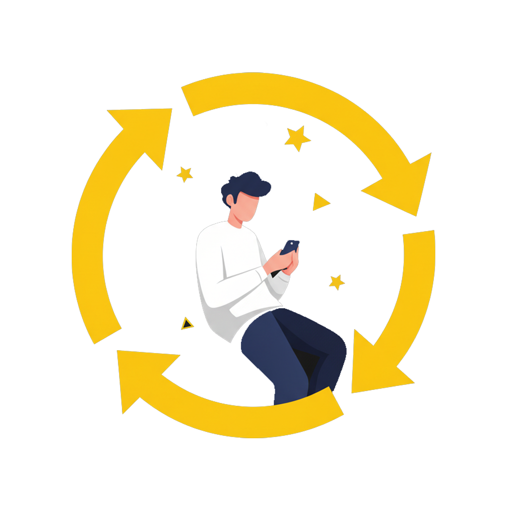

<div align="center">


# RateMe

**The first Iraqi app dedicated to rating movies and TV shows.**

Browse global film and TV data from TMDB, rate what you watch, build personal lists,
and share your picks as beautiful story cards.

[](https://flutter.dev)
[](https://dart.dev)
[](https://supabase.com)
[](https://www.themoviedb.org)
[]()

</div>

---

## About

RateMe is a Flutter movie and TV tracker built around a simple loop: **discover → rate → collect → share.**
It pairs TMDB's global catalogue with a localized experience aimed at Iraqi and Arab film lovers.

Everything you rate and save syncs to Supabase behind row-level security, so your lists follow you
across devices — and browsing works without an account at all.

---

## Features

<table>
<tr>
<td width="33%" align="center"><br /><b>Rate films & shows</b><br /><sub>0–10 ratings with short written reviews, shown next to the TMDB community average.</sub></td>
<td width="33%" align="center"><br /><b>Build your lists</b><br /><sub>Watched, Watch Later, and unlimited custom lists with search, sort, and drag-to-reorder.</sub></td>
<td width="33%" align="center"><br /><b>Sync everywhere</b><br /><sub>Lists and ratings persist to Supabase and merge automatically when you first sign in.</sub></td>
</tr>
</table>

**Discovery** — trending, top-rated and upcoming rows; full-text search across movies, shows, and actors; paginated genre browsing; adult-content filtering with vote-count validation.

**Detail pages** — genres, runtime, cast, trailers, and per-season/episode breakdowns for TV. Every cast member links through to a full actor profile with their credits.

**Share cards** — turn a rating or a recommendation into a rendered image (with a backdrop picker and crop editor) and send it through the native share sheet.

**Auth** — Google OAuth *and* email/password with OTP email verification. Guests can browse read-only; anything they saved locally is uploaded on first sign-in. Account deletion is supported.

**Polish** — dark theme, shimmer skeletons, cached images, carousel banners, blurred bottom navigation, and deep links (`/movie/:id`, `/tv/:id`).

**Reminders** — configurable daily local notification to log what you watched.

---

## Tech stack

| Layer | Choice |
|---|---|
| Framework | Flutter (Dart 3.10+) |
| State | `flutter_riverpod` 2.6 — StateNotifier + FutureProvider |
| Navigation | `go_router` 14 |
| Backend | Supabase — Auth + PostgreSQL with RLS |
| Movie data | TMDB API v3 (Bearer token) |
| HTTP | `dio` 5 |
| Images | `cached_network_image`, `palette_generator` |
| Local storage | `shared_preferences`, `flutter_secure_storage` |
| Notifications | `flutter_local_notifications` |
| Sharing | `share_plus` |
| Typeface | Poppins |

---

## Project structure

```
lib/
  core/
    config/       # Secrets (gitignored) — see secrets.example.dart
    constants/    # AppConstants — TMDB base URLs, image size helpers
    models/       # Movie, MovieDetail, TvDetail, ActorDetail, CustomList, …
    providers/    # Riverpod providers: auth, lists, custom_lists, tmdb, theme, …
    services/     # TmdbService (Dio), SupabaseService, NotificationService
    theme/        # AppTheme, AppColors
  features/
    auth/         # Sign in, sign up, OTP verification
    home/         # Home feed, featured banner, movie rows, See All
    search/       # Search across movies, shows, actors
    lists/        # Watched / Watch Later / custom lists
    movie_detail/ # Movie detail + share card widgets
    tv_detail/    # TV detail, season & episode screens
    actor/        # Actor profile
    profile/      # Profile, stats, settings
  shared/
    navigation/   # GoRouter config, MainScaffold (bottom nav)
    widgets/      # MovieCard, MovieListTile, RatingBadge, SectionHeader, …
```

---

## Getting started

### Prerequisites

- Flutter SDK 3.10.4 or newer
- A [TMDB API key and read access token](https://www.themoviedb.org/settings/api)
- A [Supabase project](https://supabase.com/dashboard) (free tier is fine)

### 1. Clone and install

```bash
git clone https://github.com/tahakadhim00-afk/Rateme.git
cd Rateme
flutter pub get
```

### 2. Configure your credentials

Secrets are injected at build time and are **never** committed. Copy the template:

```bash
cp dart_defines/secrets.example.json dart_defines/secrets.json
```

Then fill in your own values:

```json
{
  "TMDB_API_KEY": "…",
  "TMDB_READ_TOKEN": "…",
  "SUPABASE_URL": "https://YOUR_PROJECT_REF.supabase.co",
  "SUPABASE_ANON_KEY": "…"
}
```

### 3. Set up the database

Create the tables below in your Supabase project and **enable row-level security on each**, with
policies restricting every row to `auth.uid() = user_id`.

| Table | Purpose |
|---|---|
| `user_lists` | `user_id + media_id + list_type` — unique on the triple. `list_type` ∈ `watched`, `watchLater`, `favorites` |
| `ratings` | `user_id + media_id + score + review` |
| `custom_lists` | User-created lists and their items |
| `user_preferences` | Per-user settings |

Only identifiers are stored — all titles, posters, and metadata are fetched from TMDB on demand.

### 4. Run

```bash
flutter run --dart-define-from-file=dart_defines/secrets.json
```

### 5. Build a release

```bash
./build_release.bat        # Windows — obfuscated APK + App Bundle
```

Release signing reads `android/key.properties` (gitignored — copy from `key.properties.example`).
If that file is absent the build falls back to debug keys, so **never** ship a store build without it.
Obfuscation symbols land in `build/debug-info/`; keep them to de-obfuscate crash reports, and never
commit or ship them.

---

## Security

This repository is public, and it is set up so that no credential ever lands in a commit:

- **No secrets in source.** TMDB and Supabase credentials come from `dart_defines/secrets.json`
  at build time. Both that file and `lib/core/config/secrets.dart` are gitignored, with
  `.example` templates checked in instead.
- **No signing material.** `android/key.properties` and every keystore are gitignored.
- **HTTPS enforced.** Cleartext traffic is blocked app-wide, and release builds trust only
  system CAs — a proxy that installs its own root certificate cannot intercept traffic.
  User CAs are trusted in debug builds only, for local inspection.
- **Row-level security.** Every Supabase table is scoped to the authenticated user; the anon key
  grants no access to another user's rows.
- **Obfuscated releases.** Release builds run with `--obfuscate` and R8 minification.

Found a security issue? Please open an issue — or contact the maintainer directly for anything
sensitive, rather than filing publicly.

---

## Roadmap

| Item | Status |
|---|---|
| Google OAuth + email/password auth | ✅ Done |
| Watched / Watch Later / custom lists | ✅ Done |
| Ratings and text reviews | ✅ Done |
| Rating & recommendation share cards | ✅ Done |
| Actor pages, TV seasons & episodes | ✅ Done |
| Arabic language support | 🔲 Planned |
| Iraq-local trending & community feed | 🔲 Planned |
| Push notifications | 🔲 Planned |

---

## Acknowledgements

This product uses the TMDB API but is **not** endorsed or certified by TMDB.


Typeface: [Poppins](https://fonts.google.com/specimen/Poppins) (SIL Open Font License).

---

<div align="center">
<sub>Built with Flutter 💛</sub>
</div>
